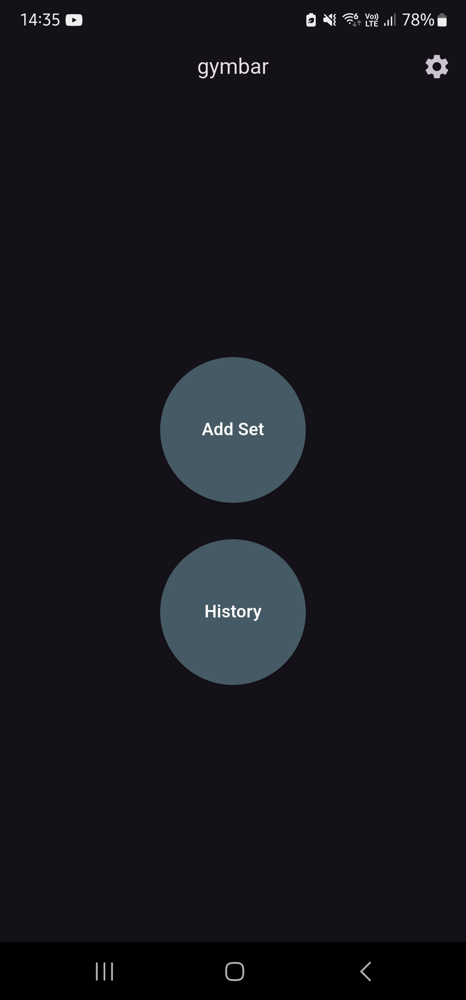
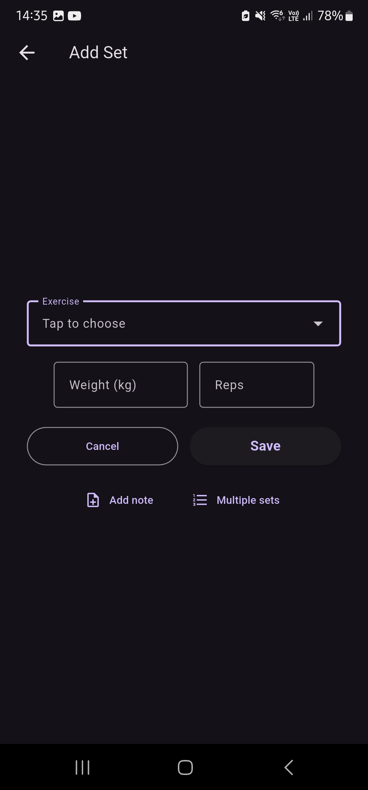
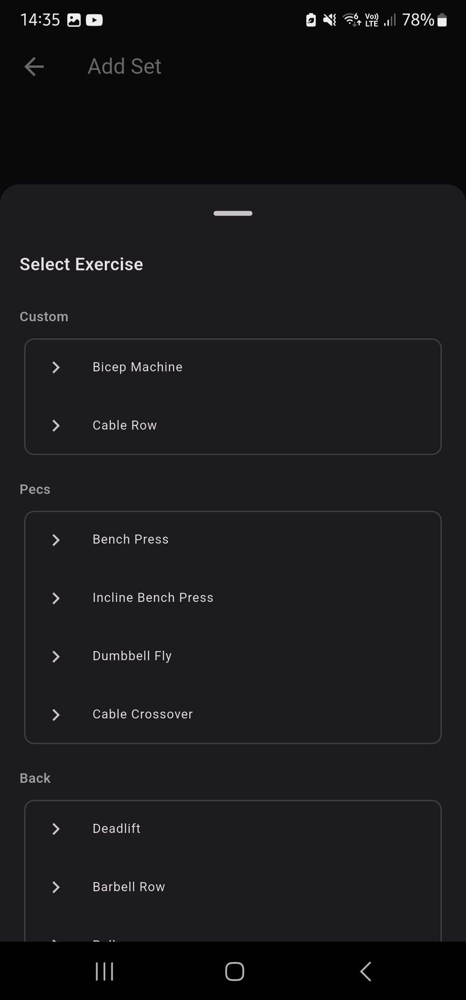
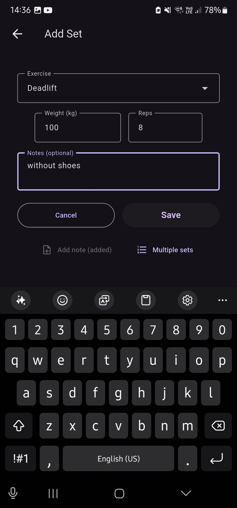
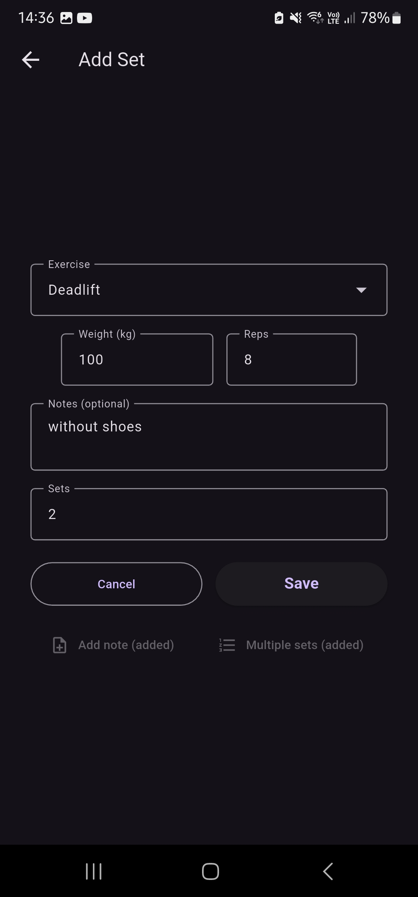
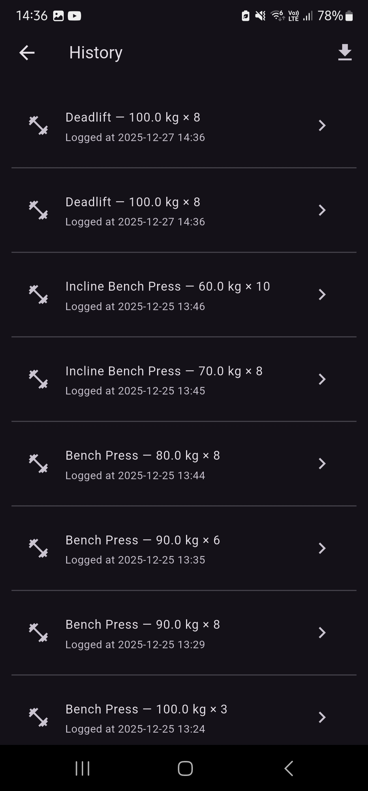
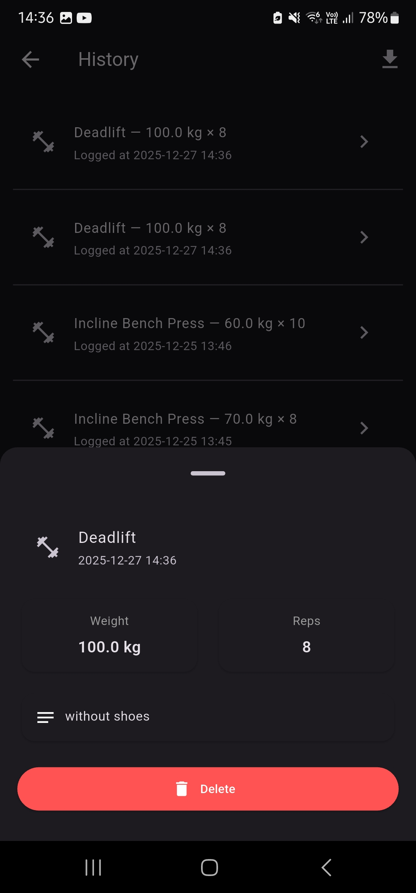
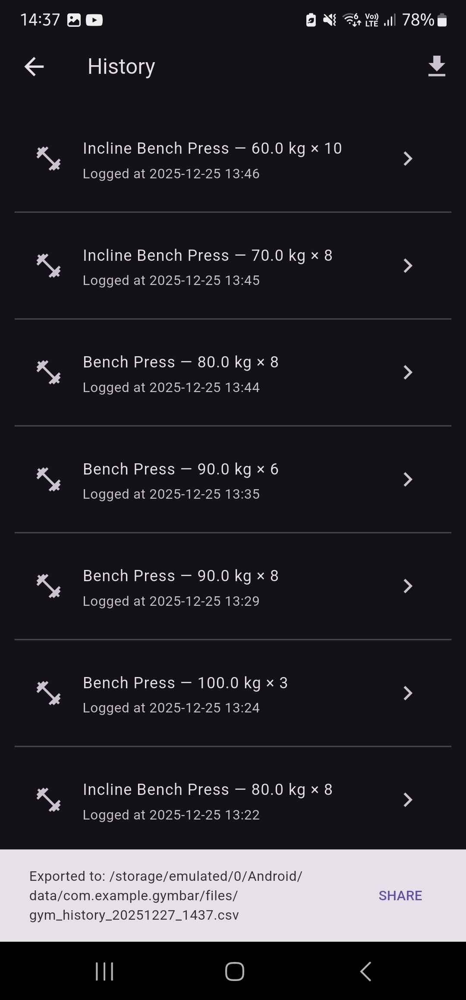
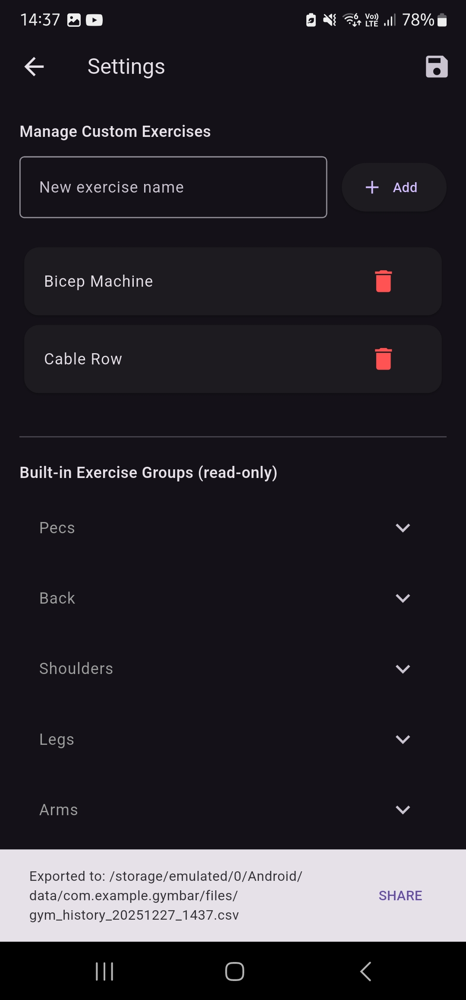

# gymbar

A Flutter-based gym workout logging application that helps you track your exercise sets, weights, and progress over time.

## Overview

**gymbar** is a simple and intuitive mobile app for tracking your gym workouts. Log your sets with weights and reps, review your training history, manage custom exercises, and export your data for analysis.

## Features

### Workout Logging
- Log gym sets with exercise name, weight (kg), and reps
- Add optional notes to each set for additional context
- Create multiple sets at once for efficient logging
- Automatic timestamp tracking for all logged sets

<div align="center">
  
  
  
</div>

### History & Tracking
- View your complete workout history sorted by date (newest first)
- Detailed view of each logged set
- Delete individual sets when needed
- All data is stored locally on your device

<div align="center">
  
  
  
</div>

### Exercise Management
- **Built-in Exercise Groups**: Pre-configured exercises organized by muscle groups:
  - **Pecs**: Bench Press, Incline Bench Press, Dumbbell Fly, Cable Crossover
  - **Back**: Deadlift, Barbell Row, Pull-up, Lat Pulldown
  - **Shoulders**: Overhead Press, Dumbbell Shoulder Press, Lateral Raise, Rear Delt Fly
  - **Legs**: Squat, Front Squat, Romanian Deadlift, Leg Press, Lunge
  - **Arms**: Bicep Curl, Hammer Curl, Triceps Pushdown, Skull Crushers
  - **Abs**: Crunches, Plank, Hanging Leg Raise, Cable Crunch
  - **Glutes**: Hip Thrust, Glute Bridge
  - **Calves**: Standing Calf Raise, Seated Calf Raise
- **Custom Exercises**: Add your own exercise names that aren't in the built-in list
- Organize and manage your custom exercises list

<div align="center">
  
  
  
</div>

### Data Export
- Export your complete workout history to CSV format
- Share exported data via your device's share functionality
- Timestamped file names for easy organization
- Compatible with spreadsheet applications (Excel, Google Sheets, etc.)

### Settings
- Manage your custom exercise list
- View all built-in exercises organized by muscle groups
- Simple and clean interface

## Technical Details

### Built With
- **Flutter** - Cross-platform mobile framework
- **Dart** - Programming language

### Key Dependencies
- `shared_preferences` - Local data persistence
- `path_provider` - File system access
- `share_plus` - Share functionality
- `file_saver` - File export capabilities

### Data Storage
- All workout data is stored locally on your device using SharedPreferences
- No cloud sync or internet connection required
- Your data remains private and secure on your device

## Getting Started

### For Users

1. Install the app on your device
2. Tap "Add Set" to log your first workout
3. Select an exercise from the built-in list or add custom exercises in Settings
4. Enter weight and reps
5. Optionally add notes or create multiple sets
6. View your history anytime to track progress
7. Export your data to CSV when you need to analyze it elsewhere

### For Developers

#### Prerequisites
- Flutter SDK (3.10.4 or higher)
- Dart SDK
- Android Studio / Xcode (for mobile development)
- VS Code or Android Studio (recommended IDEs)

#### Installation

1. Clone the repository:
   ```bash
   git clone <repository-url>
   cd gymbar
   ```

2. Install dependencies:
   ```bash
   flutter pub get
   ```

3. Run the app:
   ```bash
   flutter run
   ```

#### Project Structure

```
lib/
├── main.dart              # App entry point
├── app.dart               # Main app widget
├── models/
│   └── gym_set.dart      # GymSet model class
├── data/
│   └── exercise_groups.dart  # Built-in exercise groups
├── services/
│   └── storage_service.dart  # Data persistence service
└── screens/
    ├── main_menu_screen.dart
    ├── add_set_screen.dart
    ├── history_screen.dart
    └── settings_screen.dart
```

## License

This project is private and not intended for publication.

## Version

Current version: 1.0.0
